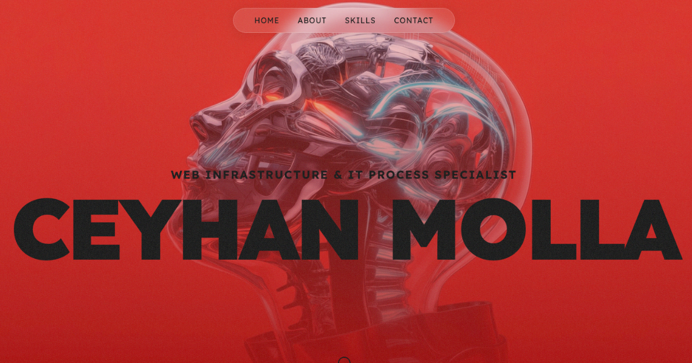

# Ceyhan Molla Portfolio

**Web Infrastructure & IT Process Specialist with 20+ years of experience**

A modern, high-performance portfolio website built with pure HTML, CSS, and JavaScript. Showcases expertise in web infrastructure, IT processes, automation, and security.



## ✨ Features

- **Glassmorphism UI**: Modern frosted glass navigation with backdrop blur
- **Fully Responsive**: Mobile-first design with fluid typography and adaptive layouts
- **Parallax Scrolling**: Immersive scroll experience with dynamic parallax effects on statistics
- **Animated Statistics**: Counter animations triggered by intersection observer
- **Interactive Skills Section**: Accordion UI with smooth expand/collapse animations
- **Progressive Web App (PWA)**: Web App Manifest, multiple favicon sizes
- **Accessibility Compliant**: ARIA labels, keyboard navigation, skip links, focus management
- **Performance Optimized**: Preloaded critical assets, Cloudflare edge caching, Brotli compression
- **SEO Optimized**: Comprehensive meta tags, Open Graph, Twitter Cards, JSON-LD structured data
- **Dynamic Copyright**: Automatically updates year using JavaScript

## 🛠️ Tech Stack

- **HTML5**: Semantic markup with accessibility in mind
- **CSS3**: Custom properties (CSS variables), flexbox, grid, animations, backdrop-filter
- **Vanilla JavaScript**: No frameworks, pure ES6+ with modular architecture
- **Canvas API**: Dynamic particle connections in the stats section
- **PWA Standards**: Web App Manifest, responsive icons

## 🎨 Design Highlights

- **Color Scheme**: Brand red (#E62020) on deep black (#0A0A0A)
- **Typography**: Lexend font family for excellent readability
- **Micro-interactions**: Hover states, focus rings, smooth transitions
- **Scroll Progress Bar**: Visual indicator at the top of the page
- **Grain Overlay**: Subtle texture for tactile feel
- **Dark Mode**: Optimized for dark theme by default

## 📂 Project Structure

```
├── index.html              # HTML structure and markup
├── style.css               # All styles and animations
├── main.js                 # JavaScript modules and interactions
├── manifest.json           # PWA manifest
├── README.md              # This file
└── images/                # Assets
    ├── hero.webp          # Hero background (preloaded)
    ├── 01.webp            # Skill section backgrounds
    ├── 02.webp
    ├── 03.webp
    ├── logo.svg           # Vector logo
    ├── favicon.ico
    ├── favicon-16x16.png
    ├── favicon-32x32.png
    ├── apple-touch-icon.png
    ├── android-chrome-192x192.png
    └── android-chrome-512x512.png
```

## 🚀 Deployment

Deployed on **Cloudflare Workers** with automatic Git integration. Push to `main` triggers auto-build and deploy.

```bash
# Make changes and push
git add .
git commit -m "güncelleme"
git push origin main
```

**Live URL**: https://ceyhanmolla.com

## ♿ Accessibility Features

- ✅ **Skip to main content** link for keyboard users
- ✅ **Semantic HTML**: proper heading hierarchy (h1, h2, h3, etc.)
- ✅ **ARIA labels** and roles for interactive components
- ✅ **Keyboard navigation** support for all interactive elements
- ✅ **Focus management** for modal navigation
- ✅ **Reduced motion** support (`prefers-reduced-motion`)
- ✅ **Color contrast** meets WCAG guidelines
- ✅ **Touch-friendly** target sizes (44px minimum)

## 📱 Browser Support

- Chrome/Edge (latest)
- Firefox (latest)
- Safari (latest)
- Mobile browsers (iOS Safari, Chrome Mobile)

Uses modern CSS features with graceful degradation:
- `backdrop-filter` (Chrome 76+, Safari 9+, Firefox 103+)
- CSS Grid and Flexbox
- CSS Custom Properties
- IntersectionObserver API
- WebP image format (with fallbacks if needed)

## 🔒 Security & Performance

- **Content Security Policy** headers defined
- **Strict referrer policy** for privacy
- **Preload hints** for critical resources (hero image)
- **DNS prefetch** for external domains (LinkedIn, YouTube, etc.)
- **Cloudflare edge caching** with Brotli compression
- **Canvas particle animation** stops when off-screen
- **Optimized images**: WebP format
- **Minimal JavaScript**: Vanilla JS, no frameworks
- **No external dependencies**: Except Google Fonts

## 📝 Content Sections

1. **Hero**: Full-viewport intro with bold typography
2. **About**: Revealing text animation on scroll
3. **Statistics**: Animated counters with particle background
4. **Skills**: Three categories with expandable accordion items
   - IT Infrastructure & Deployment
   - Automation & System Integration
   - IT Security & Data Analysis
5. **Contact**: Footer with social links and email

## 📄 License

All rights reserved. © 2026 Ceyhan Molla.
*Note: The live website automatically displays the current year in the copyright notice using JavaScript.*

---

**Live Site**: https://ceyhanmolla.com  
**GitHub**: https://github.com/ceyhanmolla/ceyhanmolla.com